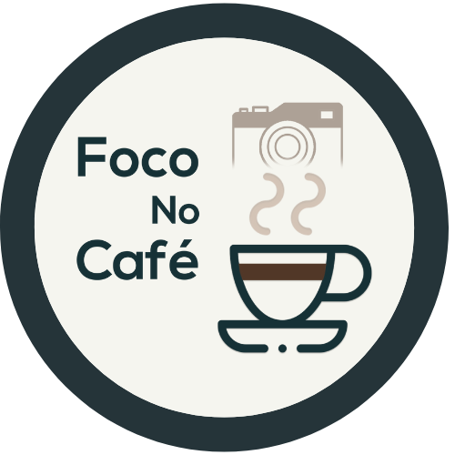

<div align="center">

</div>
<div align="center">

<p>    </p>

</div>


## -  Objective 🛠️
This project was created for an instagram coffee influencer, so it can have their afilliated links all on the same page and divided by category


## - Visit the site
The site is online! you can visit it [here](https://foconocafe.com)! If you have any problem please contact me! ✉️

## - Technologies 🚀️
On this project i used React to build the app and figma to plan the layout, i used React-Router to make the multipage and styled components to the css.

## - How to setup ⛳
First clone this project using:
```
git clone https://github.com/jravolio/LinkFree.git
```
After that open you terminal on the LinkFree folder and run:
```
yarn install
```
You just installed all the dependencies of the project, now just run:
```
yarn start
```

and the site should be functioning! :)

